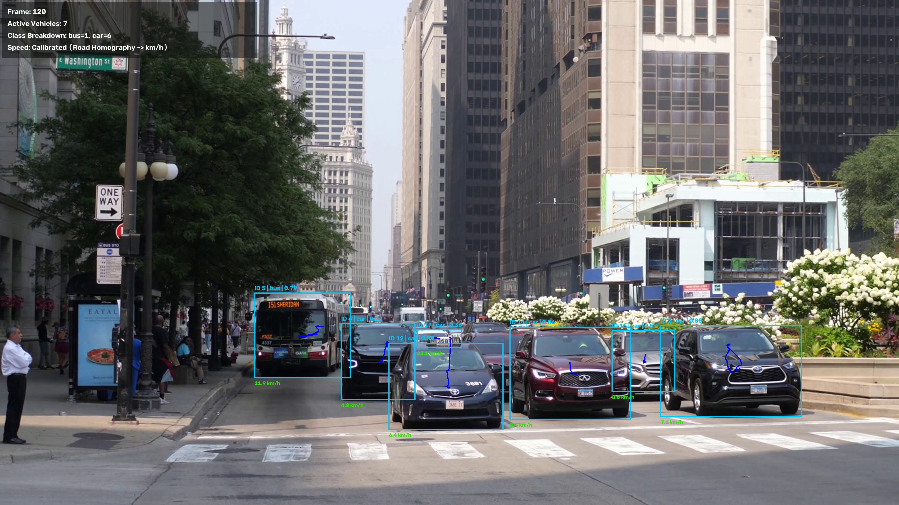

# Intelligent Traffic Surveillance & Vehicle Analytics

A modular, production-grade Computer Vision pipeline for traffic surveillance and kinematic vehicle analytics. The system performs multi-class vehicle detection, persistent multi-object tracking, planar perspective rectification via 4-point homography, real-world physical velocity estimation ($\text{km/h}$ and $\text{m/s}$), and automated export of annotated MP4 video, frame-by-frame observation logs (`vehicle_data.csv`), and consolidated summary metrics (`traffic_summary.json`).



---

## 🎯 Evaluator Quickstart (VITyarthi Headless Evaluation)

The system is designed for **headless command-line execution** without requiring a GUI or display server. This guarantees reproducible, uninterrupted evaluation in terminal sessions, SSH, Docker containers, and automated grading environments.

### 1. Environment Setup

```bash
# Clone the repository
git clone https://github.com/Devansh-Bansal-AI/traffic-vision-analytics.git
cd traffic-vision-analytics

# Create & activate a virtual environment
python -m venv .venv

# Windows PowerShell:
.\.venv\Scripts\Activate.ps1
# Windows CMD:
.venv\Scripts\activate.bat
# Linux / macOS:
source .venv/bin/activate

# Upgrade pip & install dependencies
python -m pip install --upgrade pip
pip install -r requirements.txt
```

### 2. Run the Automated Test Suite

Verify system integrity, homography transforms, tracker persistence, HCM Level of Service, and metric calculations:

```bash
python -m pytest -v
```
*Expected Output*: `13 passed in ~0.2s`

### 3. Primary Evaluation Command (Strict Headless CLI Execution)

Place your traffic video in `data/` (e.g. `data/18437773-uhd_3840_2160_50fps.mp4` or `data/traffic.mp4`) and run the headless pipeline:

```bash
python main.py --input data/18437773-uhd_3840_2160_50fps.mp4 --max-frames 300
```

> **Zero Configuration Overhead**: The system automatically detects and loads `config/calibration.json` (or synthesizes a valid urban road geometry if missing). No manual configuration is required for evaluation.
>
> **Pure Headless Output**: No desktop windows (`cv2.imshow`) are spawned. Live progress is emitted to stdout (`[CLI Engine] Processed 50/300 frames | Active vehicles: 8`), and all artifacts are saved directly to `outputs/`.

---

## 📚 Course Alignment (CSE3010 Computer Vision)

The architecture directly connects to the VIT CSE3010 Computer Vision syllabus:

| Syllabus Module | Project Implementation & Theoretical Application |
|---|---|
| **Module 1: Image & Video Processing** | Video ingestion, frame extraction, resolution-adaptive HUD typography, spatial coordinate normalization. |
| **Module 2: Perspective Geometry & Homography** | 4-point planar homography ($\mathbf{x}' \sim \mathbf{H}\mathbf{x}$) mapping 2D image coordinates to the metric ground plane for real-world velocity measurements. |
| **Module 3: Object Detection & Classification** | Ultralytics YOLO11n deep convolutional detector for vehicle classification (`car`, `bus`, `truck`, `motorcycle`). |
| **Module 4: Motion Analysis & Background Subtraction** | OpenCV MOG2 baseline with morphological opening/closing for comparative study; multi-object centroid and IoU tracking across temporal sequences. |

---

## ⚙️ Operating Modes & Speed Measurement

### 1. Calibrated Physical Mode (Recommended)
By supplying a calibration file with `--calibration config/calibration.json`, the pipeline applies a $3 \times 3$ projective homography matrix $\mathbf{H}$ calculated from 4 coplanar ground landmarks:
- **Displacement**: Converted from camera pixels to physical ground distance in metres.
- **Speed**: Computed over a moving temporal window ($N=5$) as $v = \frac{\Delta d}{\Delta t}$ in $\text{m/s}$.
- **Physical Velocity**: Converted and reported directly in $\text{km/h}$ ($v_{\text{km/h}} = 3.6 \cdot v_{\text{m/s}}$) on bounding box overlays, CSV logs, and JSON summaries.
- A calibrated landmark configuration (`config/calibration.json`) calibrated for multi-lane urban surveillance is included in the repository.

### 2. Uncalibrated Baseline Mode
When running without `--calibration`:
```bash
python main.py --input data/traffic.mp4 --max-frames 300
```
- The system evaluates motion as raw pixel displacement in $\text{pixels/s}$.
- The HUD, CSV logs, and JSON summaries explicitly tag speeds as uncalibrated pixel rates to prevent inaccurate interpretation.

### 3. Course Baseline: Motion-Based MOG2 Detector
To compare semantic detection with classical background subtraction (Module 4):
```bash
python main.py --input data/traffic.mp4 --detector mog2 --max-frames 300
```
- Uses `cv2.createBackgroundSubtractorMOG2` with morphological noise filtering.
- Useful for comparing semantic vehicle localization against motion-only foreground segmentations.

---

## 📊 Generated Outputs (`outputs/`)

Every pipeline run automatically produces three structured artifacts in [outputs/](outputs/):

### 1. `outputs/annotated_video.mp4`
Full resolution output video featuring:
- Bounding boxes color-coded with class labels and confidence scores.
- Persistent `vehicle_id` tracking tags.
- Historical centroid motion trajectories.
- Calibrated $\text{km/h}$ or pixel displacement speed tags.
- Semi-transparent heads-up display (HUD) banner showing frame count, active vehicle counts, class breakdown, and calibration status.

### 2. `outputs/vehicle_data.csv`
Detailed observation ledger logging every tracked vehicle per frame:
```csv
frame,vehicle_id,class,confidence,x,y,width,height,speed,speed_unit,speed_kmh
0,1,car,0.8969,1997,1608,488,374,0.0000,m/s,0.00
1,1,car,0.9007,1997,1607,490,376,1.0000,m/s,3.60
...
```

### 3. `outputs/traffic_summary.json`
Consolidated statistical analytics report:
```json
{
  "frames_processed": 300,
  "unique_vehicle_tracks": 29,
  "average_active_vehicles_per_frame": 7.62,
  "congestion_level": "Moderate",
  "total_vehicle_detections": 2285,
  "vehicle_detections_by_class": {
    "car": 1915,
    "bus": 351,
    "truck": 19
  },
  "average_speed": 9.084,
  "maximum_speed": 37.552,
  "speed_unit": "m/s",
  "speed_calibrated": true,
  "average_speed_kmh": 32.70,
  "maximum_speed_kmh": 135.19,
  "input_resolution": "3840x2160",
  "video_fps": 50.0,
  "output_video": "outputs/annotated_video.mp4"
}
```

---

## 🛠️ CLI Options & Performance Tuning

```text
usage: main.py [-h] --input INPUT [--output-dir OUTPUT_DIR]
               [--detector {yolo,mog2}] [--model MODEL] [--conf CONF]
               [--imgsz IMGSZ] [--device DEVICE]
               [--max-distance MAX_DISTANCE] [--max-missed MAX_MISSED]
               [--iou-threshold IOU_THRESHOLD] [--min-area MIN_AREA]
               [--calibration CALIBRATION] [--max-frames MAX_FRAMES]
               [--skip SKIP] [--show]
```

### Performance Flags for High-Resolution Videos
- **Frame Skipping (`--skip N`)**: For 4K UHD video on CPU, `--skip 1` processes every 2nd frame, doubling throughput while maintaining track stability:
  ```bash
  python main.py --input data/traffic.mp4 --calibration config/calibration.json --skip 1
  ```
- **Inference Resolution (`--imgsz`)**: Defaults to `640` px for optimal speed/accuracy trade-off.
- **Hardware Acceleration (`--device`)**: Set `--device 0` or `--device cuda` if a CUDA-enabled GPU is available.
- **Optional Visual Preview (`--show`)**: Opens a live OpenCV desktop window (only for local interactive desktop debugging; not required for headless evaluation).

---

## 🧪 Test Suite Execution

Run the complete test suite with verbose reporting:

```bash
python -m pytest -v
```

- All 13 unit and integration tests validate:
- Bounding-box IoU computation (boundary, overlap, and non-overlap cases).
- Tracker persistence across temporal sequence frames.
- Detection dataclass integrity and schema compatibility.
- Planar homography coordinate transformations.
- Calibrated $\text{m/s} \to \text{km/h}$ metric speed conversion.
- Congestion level and statistical aggregation in `TrafficAnalyzer`.
- Highway Capacity Manual (HCM) Level of Service (LOS A–F) evaluation.
- Operating speed percentiles ($V_{85}$, $V_{15}$) computation.
- MOG2 background subtractor initialization and morphological filtering.
- Configuration file fallback and dynamic road geometry synthesis resilience.

---

## 📂 Repository Structure

```text
traffic-vision-analytics/
├── main.py                      # Main CLI entry point & orchestrator
├── requirements.txt             # Project dependencies (pinned compatible versions)
├── README.md                    # Comprehensive evaluator documentation
├── statement.md                 # Formal project problem statement & scope
├── LICENSE                      # MIT Open Source License
├── config/
│   ├── calibration.json         # Verified 4-point homography road calibration
│   └── calibration.example.json # General template for user calibrations
├── src/
│   ├── __init__.py
│   ├── detector.py              # YOLO11n & MOG2 dual detector engine
│   ├── tracker.py               # Centroid & IoU multi-object tracking
│   ├── homography.py            # Planar perspective homography mapping
│   ├── speed_estimator.py       # Discrete velocity estimation & filtering
│   ├── traffic_analyzer.py      # Statistical aggregation & congestion classification
│   ├── visualizer.py            # Resolution-adaptive overlays & HUD rendering
│   └── video_processor.py       # Frame processing loop & CSV/MP4 streaming
├── tests/
│   ├── test_analyzer.py         # Traffic analyzer unit tests
│   ├── test_homography.py       # Homography mapping unit tests
│   ├── test_pipeline_integration.py # End-to-end integration & calibrated tests
│   ├── test_speed.py            # Speed calculation unit tests
│   └── test_tracker.py          # Tracking & IoU unit tests
├── scripts/
│   └── generate_pdf_report.py   # Automated 15-section PDF report compiler
├── data/
│   ├── .gitkeep
│   └── README.md                # Video placement guide (large videos excluded from Git)
├── outputs/
│   └── .gitkeep                 # Output target directory
├── docs/
│   ├── ARCHITECTURE.md          # Full architectural & mathematical specification
│   └── demo_preview.jpg         # Sample annotated detection visual
└── report/
    ├── PROJECT_REPORT.md        # Comprehensive 15-section academic project report
    └── PROJECT_REPORT.pdf       # Compiled submission-ready PDF project report
```

---

## 📄 Key Documentation Links

- **Compiled PDF Project Report (Portal Ready)**: [report/PROJECT_REPORT.pdf](report/PROJECT_REPORT.pdf)
- **Academic Project Report (Markdown)**: [report/PROJECT_REPORT.md](report/PROJECT_REPORT.md)
- **System Architecture & Math**: [docs/ARCHITECTURE.md](docs/ARCHITECTURE.md)
- **Project Problem Statement**: [statement.md](statement.md)
- **Calibration Geometry**: [config/calibration.json](config/calibration.json)

---

## 📜 License
This project is licensed under the MIT License — see the [LICENSE](LICENSE) file for details.
